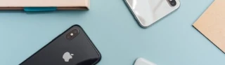
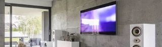

* Nombre: Matias Casiba
* Link Github Repo: https://github.com/MatiCasiba/productos
* Link Netlify: https://productardos.netlify.app/

# Página Productos

## Colocando titulo, subtitulos, textos y nombres de las imágenes
Para ir armando esta página, voy a estar usando de momento los siguientes elementos
```sh
<h1> Titulo </h1>
<h2> Subtitulos </h2>
 # acá llamaré a las imágenes.
<p> Texto <p>
```

## Color de fondo y letras
Al momento de darle color al fondo lo haré de la siguiente manera en css:
```sh
body{
    background-color: rgb(52, 62, 85); # nuestro color de fondo
    color: white; # es el color de la letra en textos
}
```

### Color de letra y fondo para el título
El elemento h1 tendrá un color aparte tanto en su fondo como en la letra, lo hago de esta forma:
```sh
h1{
    background-color: white; # su color de fondo
    text-align: center;
    color: rgb(93, 110, 148); # su color de letra
}
```
* Nota: para centrar el título utilizo el text-align: center;

### Color a los elementos h2
Cáda elemento h2 tendrá un color distino, para lograr esto, en cada elemento h2 del archivo index.html, le agrego una clase con distinos valores, estos son:
```sh
<h2 class="color-1">Aspiradoras</h2>
<h2 class="color-2">Celulares</h2>
<h2 class="color-3">Consolas</h2>
<h2 class="color-4">Home theaters</h2>
<h2 class="color-5">Televisores</h2>
```
Esto me permitirá en css darles color a cada uno:
```sh
.color-1{
    color: bisque;

}
.color-2{
    color: rgb(127, 145, 177);
}
.color-3{
    color: rgb(200, 212, 212);
}
.color-4{
    color: rgb(162, 157, 157);
}
.color-5{
    color: rgb(239, 229, 216);
}
```

## Colocando imágenes y dándoles bordes
Para agregrar imagenes y con bórdes, primero en el index.html, a los elementos img le voy a agregar clases con distintos valores, esto me permite darles a cada borde colores distintos:
```sh





```
* Nota: dentro del src="" se encuentra la dirección en donde están las imágenes, se encuentran en una carpeta image, que está dentro de otra carpeta llamada public. En el index.html verás, ejemplo: /image/consolas.webp, esto lo realicé así por recomendación de la consola.

Entonces una vez hechas las clases, les daré un grosor, un estilo de borde y el mismo color de los subtitulos que tenga cada elemento htmml:
```sh
.borde-1{
    border: 4px ridge  bisque;
}
.borde-2{
    border: 4px ridge rgb(127, 145, 177);
}
.borde-3{
    border: 4px ridge rgb(200, 212, 212);
}
.borde-4{
    border: 4px ridge rgb(162, 157, 157);
}
.borde-5{
    border: 4px ridge rgb(239, 229, 216);
}
```
* Nota: 4px (el grosor del borde) ridge(el estilo del borde) color(el color del borde).

## Fuentes y diseños en imágen
En los elementos h1, h2 y p, les daré una fuente para cada elemento, ajustando el tamaño de letra, estilos y grosor, incluso transformaré el texto de los elementos h2 en mayúculas:
```sh
h1{
    font-family: Impact, Charcoal, sans-serif; # la tipografía
    font-size: 95px; #tamaño de letra
}
h2{
    font-size: 25px;
    font-family: Arial, Gadget, sans-serif;
    font-weight: 900; #grosor de la letra
    text-transform: uppercase; # texto en mayúscula, las palabras en minúscula que se encuentren en este elemento, pasarán a ser mayúsculas
    font-style: italic; # un estilo para el texto
}
p{
    font-family: 'Lucida Sans Unicode', 'Lucida Grande', sans-serif;
    font-size: 16px;
    text-align: justify;
}
```
* Nota: en el elemento p, el text-align: justify, me servirá para ver el texto ocupando toda la pantalla (por así decirlo), sin dejar espacios en los laterales.

### Diseño en la imagen
A las imágenes, les daré un ancho y un márgen izquierdo:
```sh
img{
    width: 400px; # ancho
    margin-left: 40px; #margen izquierdo, esto le genera un espacio a la izquierda en las imágenes
}
```

## Un cambio de color en las clases color-2 y border-2
Se actualizaron los colores de estas clases:
```sh
.borde-2{
    border: 4px ridge rgb(179, 199, 237);
}

.color-2{
    color: rgb(179, 199, 237);
}
```